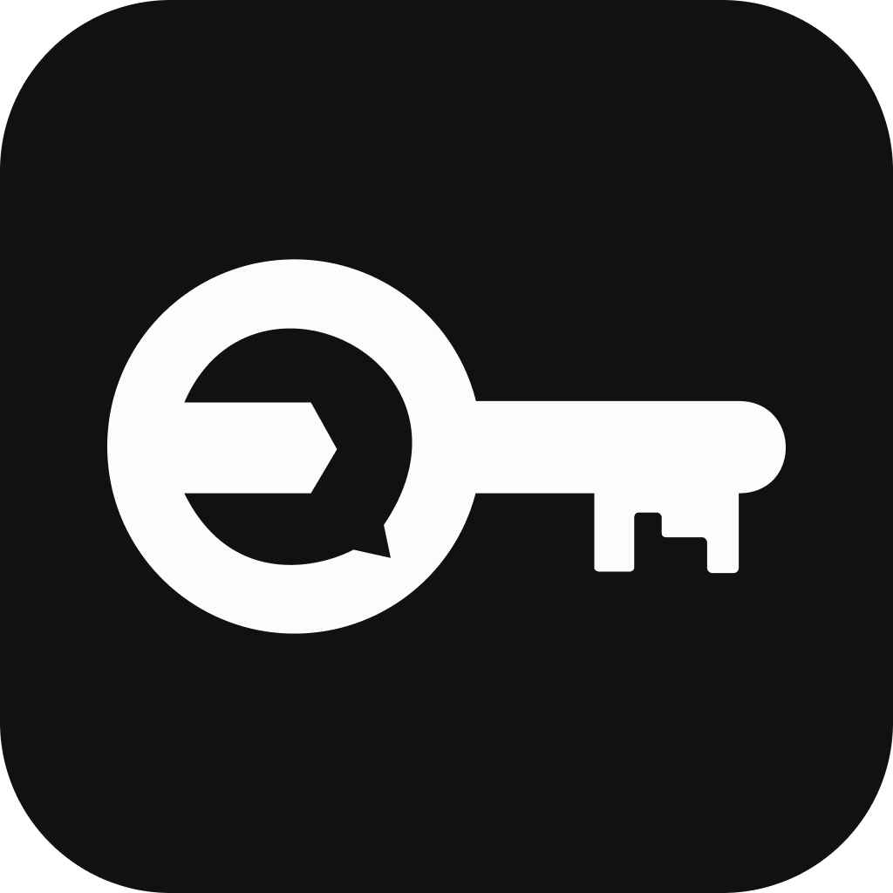
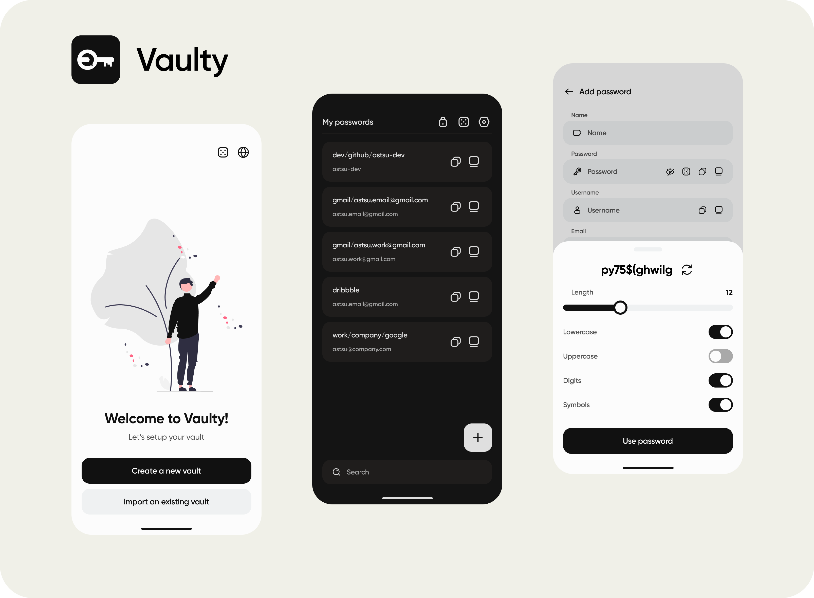

[Українська](https://github.com/astsu-dev/vaulty-mobile/blob/main/README_UA.md)

# Vaulty - secure and simple password manager mobile application

Vaulty is a password manager mobile application with simple and intuitive user interface that helps you store
and manage your passwords in a secure way. It uses AES-256 GCM encryption to encrypt your passwords and store
them in a local database.

Vaulty introduces a new way to manage your passwords.
Instead of having multiple versions of the app for different platforms,
you store your passwords only on your mobile device and copy them to other devices
using [Vaulty Remote Clipboard](https://github.com/astsu-dev/vaulty-remote-clipboard) desktop application.
In the result you have a single source of truth for your passwords and can access them from any device.
The user experience is similar to AirDrop feature on iOS.

## Features

⚡ Securely store and manage your passwords

⚡ Very simple and intuitive user interface

⚡ Copy passwords to other devices using [Vaulty Remote Clipboard](https://github.com/astsu-dev/vaulty-remote-clipboard)

⚡ Generate strong passwords using the built-in password generator

⚡ Backup to a file. You can backup all your passwords and not be afraid of losing it

⚡ Localized in English and Ukrainian languages

⚡ Dark mode

⚡ Fully free and open source

⚡ No ads

⚡ Works offline. Your privacy is in the first place

## Installation

You can download the APK file from the [Releases](https://github.com/astsu-dev/vaulty-mobile/releases/latest) page to install the app on your Android device.
iOS version is not available at the moment.

## FAQ

- **How does Vaulty encrypt my passwords?**  
  Vaulty uses AES-256 GCM encryption to encrypt your data. This is a very secure encryption algorithm that is used by many companies to encrypt sensitive data.
  Your data is encrypted with a master password that you set when you create a new vault. This password is not stored anywhere and is used only to encrypt and decrypt your data.
  The vault is decrypted only when you unlock your vault with your master password and stored only in memory while the app is running.
  When you create a backup, the resulting file is encrypted with your master password.
- **How can I trust Vaulty?**  
  Vaulty is fully open source and you can check the source code yourself. You can also build the app yourself and install it on your device.
- **Can I use Vaulty on desktop?**
  Yes, you can use Vaulty on Windows, MacOS and Linux using [Vaulty Remote Clipboard](https://github.com/astsu-dev/vaulty-remote-clipboard).
- **Can I use Vaulty on iOS?**
  No, Vaulty is only available for Android at the moment.
