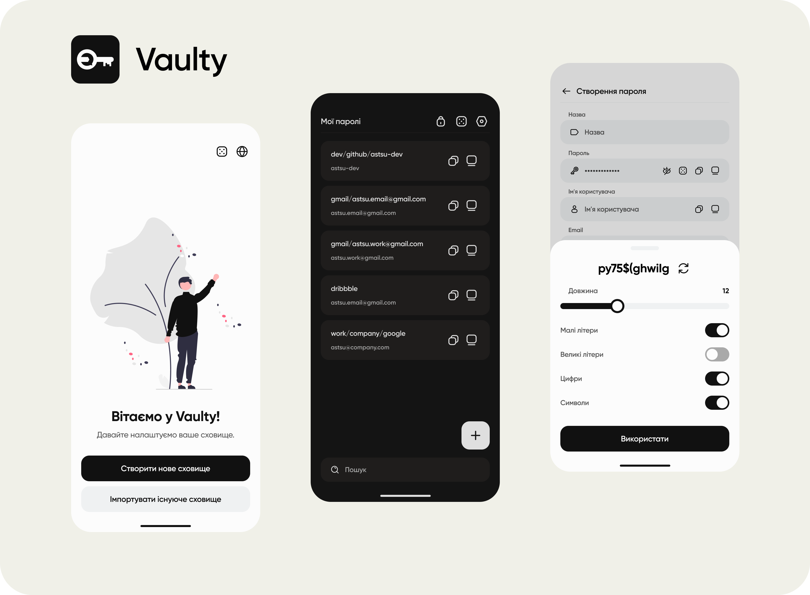

[English](https://github.com/astsu-dev/vaulty-mobile)

# Vaulty - безпечний та простий мобільний додаток для керування паролями

Vaulty - це мобільний додаток для керування паролями з простим та інтуїтивним інтерфейсом, що допомагає вам безпечно зберігати
та керувати вашими паролями. Він використовує алгоритм шифрування AES-256 GCM, щоб шифрувати ваші паролі та зберігати
їх у локальній базі даних.

Vaulty започатковує новий спосіб керування вашими паролями.
Замість того, щоб мати кілька версій додатка для різних платформ,
ви зберігаєте свої паролі лише на своєму мобільному пристрої та копіюєте їх на інші пристрої
за допомогою [Vaulty Remote Clipboard](https://github.com/astsu-dev/vaulty-remote-clipboard).
В результаті немає проблем з синхронізацією паролів між пристроями та вони доступні з будь-якого пристрою.
По зручності це схоже на функцію AirDrop на iOS.

## Основні функції

⚡ Безпечно зберігайте та керуйте своїми паролями

⚡ Дуже простий та інтуїтивний інтерфейс

⚡ Копіюйте паролі на інші пристрої використовуючи [Vaulty Remote Clipboard](https://github.com/astsu-dev/vaulty-remote-clipboard)

⚡ Генеруйте надійні паролі за допомогою вбудованого генератора паролів

⚡ Резервне копіювання. Ви можете зробити резервну копію всіх своїх паролів та не боятися їх втратити

⚡ Перекладено на англійську та українську мови

⚡ Темна тема

⚡ Повністю безкоштовний та відкритий код

⚡ Відсутність реклами

⚡ Працює офлайн. Ваша конфіденційність на першому місці

## Встановлення

Ви можете встановити додаток з [Google Play](https://play.google.com/store/apps/details?id=com.astsu_dev.vaulty)
або завантажити APK файл зі сторінки [Releases](https://github.com/astsu-dev/vaulty-mobile/releases/latest).
Версія для iOS наразі недоступна.

## Часті запитання

- **Як Vaulty шифрує мої паролі?**  
  Vaulty використовує алгоритм шифрування AES-256 GCM для шифрування ваших даних. Це дуже безпечний алгоритм шифрування, який використовується багатьма компаніями.
  Ваші дані шифруються паролем, який ви встановлюєте при створенні сховища. Цей пароль не зберігається ніде і використовується лише для шифрування та розшифрування ваших даних.
  Сховище розшифровується лише тоді, коли ви розблоковуєте своє сховище паролем і зберігається лише в пам'яті поки додаток працює.
  При створенні резервної копії результуючий файл шифрується вашим паролем до сховища.
- **Як я можу довіряти Vaulty?**  
  Vaulty має повністю відкритий код і ви можете перевірити його самостійно. Ви також можете зібрати додаток самостійно та встановити його на свій пристрій.
- **Чи можу я використовувати Vaulty не на мобільних платформах?**
  Так, ви можете використовувати Vaulty на Windows, MacOS та Linux за допомогою [Vaulty Remote Clipboard](https://github.com/astsu-dev/vaulty-remote-clipboard).
- **Чи можу я використовувати Vaulty на iOS?**
  Ні, наразі Vaulty доступний лише для Android.
